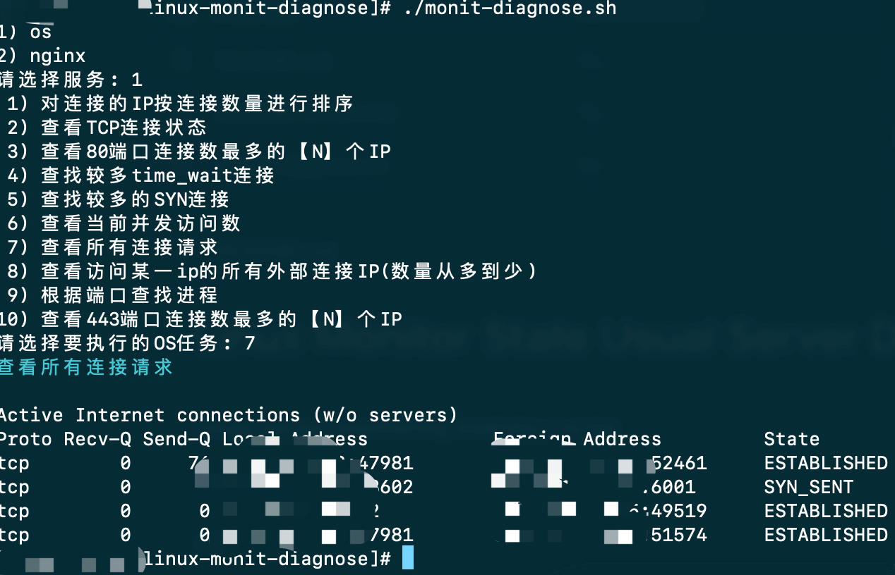

# Linux Monitor State Usual Server Diagnosis Script

#### 常用服务器监控诊断统计脚本

[English Document](README.md)

### OS

* 对连接的IP按连接数量进行排序"

* 查看TCP连接状态"

* 查看80端口连接数最多的20个IP"

* 查找较多time_wait连接"

* 查找较多的SYN连接"

* 查看当前并发访问数"

* 查看所有连接请求"

* 查看访问某一ip的所有外部连接IP(数量从多到少)"

* 根据端口查找进程"

### Nginx

* 查看访问记录，从1000行开始到3000"

* 查看访问记录，从1000行开始，显示200行"

* 根据访问IP统计UV"

* 统计访问URL统计PV"

* 查询访问最频繁的URL"

* 查询访问最频繁的IP"

* 通过日志查看含有send的url,统计ip地址的总连接数"

* 通过日志查看当天指定ip访问次数过的url和访问次数"

### 示例

